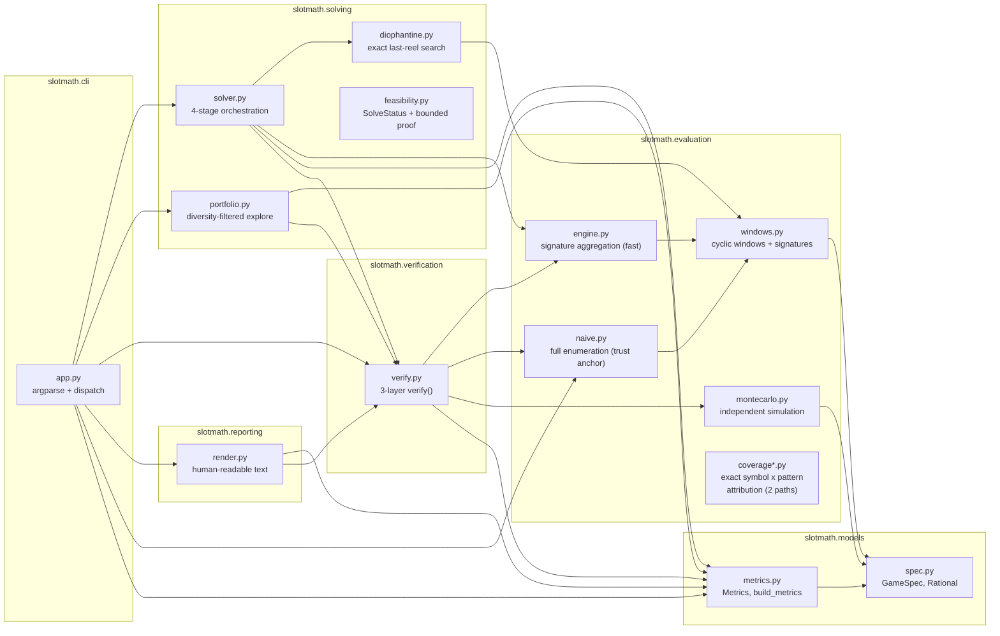
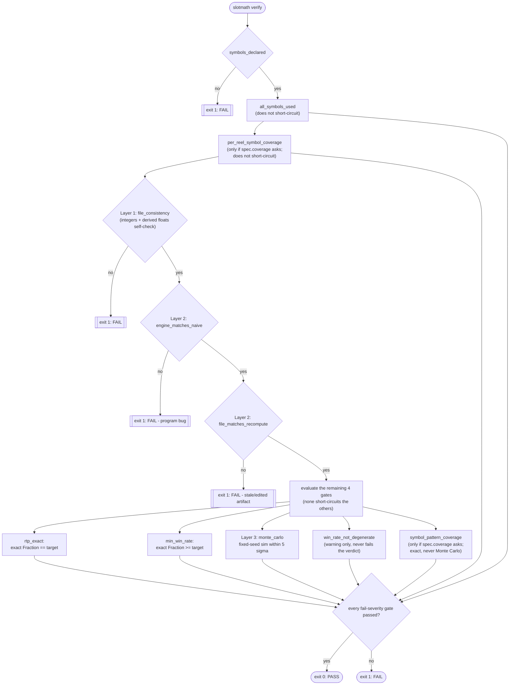

# Slot Reel Solver

[](https://github.com/Y3NH0/slot-reel-solver/actions/workflows/ci.yml)

A solver for finding reel configurations that achieve an exact target RTP while satisfying a minimum win-rate constraint. The Python package is named `slotmath`.

RTP is matched **exactly** — not approximately, not within a tolerance band, but as an exact rational number. RTP claims in this domain should be provable, not eyeballed from a simulation.

## Submission Result

| Metric | Requirement | Result |
|---|---:|---:|
| RTP | exactly 0.95 | exactly `19/20` = 0.95 |
| Win rate | ≥ 0.55 | exactly `113/200` = 0.565 |
| Reel lengths | unrestricted | 10, 16, 15 |
| Evaluation | — | exact enumeration of all 2400 outcomes |

`19/20` is an exact `Fraction` equality against the target, not a rounded decimal. The 2400 outcomes are `10 × 16 × 15`, every combination of reel stop positions, each counted exactly once.

## Reel Configuration

- Reel 1: `[0, 2, 2, 2, 2, 4, 1, 2, 2, 3]`
- Reel 2: `[1, 4, 2, 2, 2, 2, 2, 2, 3, 2, 2, 2, 2, 0, 2, 2]`
- Reel 3: `[1, 2, 2, 0, 2, 2, 2, 4, 2, 2, 3, 2, 2, 2, 0]`

Payout distribution: 1044 outcomes pay nothing, 744 pay 1×, 444 pay 2×, 144 pay 3×, 24 pay 9×.

The 2× and 3× outcomes are spins where several winning patterns overlap and their payouts add; the 9× outcomes are all four squares plus the full grid at once — see [Assumptions](#assumptions). **All five of the assignment's patterns actually occur**, including pattern 4.5 (the full grid), at probability `1/100`.

## Quick Verification

```bash
uv sync --locked --dev
uv run pytest -q
uv run slotmath verify solutions/homework-3x3-per-reel-coverage.json
```

`verify` recomputes the solution from its spec through two independent exact evaluators plus a fixed-seed Monte Carlo, and exits non-zero if any gate fails. It does not trust the numbers stored in the artifact — it recomputes them and compares.

### Why this configuration

The submitted reels satisfy the assignment as stated, and additionally a stricter property that the assignment does not ask for: **every reel carries every symbol**. That extra constraint is self-imposed, and the reason for keeping it is empirical rather than aesthetic.

Solved against the assignment's bare requirements, this solver reliably returns a configuration with a reel of length 3 holding a single repeated symbol, and a top payout of 3× — meaning **pattern 4.5 never occurs at all**. That is not one unlucky seed: six different seeds produced the same shape. Without a constraint pushing it elsewhere, the search settles on uniform strips because they satisfy the RTP equation soonest.

A solution that never triggers one of the five patterns the assignment defines is a poor answer to it, even though it is a valid one. Requiring every symbol on every reel costs 0.035 of win rate (0.565 against 0.600, both clear of the 0.55 floor) and buys a configuration with no degenerate reel where all five patterns fire.

`solutions/homework-3x3.json` is the bare-requirements solution, kept for comparison — see [Alternative solution](#alternative-solution-bare-requirements) below.

## Assumptions

- Every stop position on a reel has equal probability.
- A spin displays three consecutive symbols from each reel, using cyclic wrap-around.
- A spin counts as a win when its total payout is greater than zero.
- When multiple winning patterns occur in the same spin, **every** matching pattern is paid and the payouts add (`combine = "sum"`).

**On that last point.** The assignment does not state how overlapping wins combine, so this is an explicit modeling assumption — but it is the reading its own wording supports. Rule 5 defines a payout *per pattern* ("for the first four patterns, the payout is bet × symbol multiplier") and nothing anywhere says only the best-paying pattern counts. Consider:

```
2 2 3
2 2 3
2 2 3
```

Columns 1 and 2 are entirely symbol `2`, so pattern 4.1 (top-left square) and pattern 4.3 (bottom-left square) have both genuinely occurred. Patterns 4.2, 4.4 and 4.5 all need column 3 and have not. Two wins happened, so two wins are paid: 20 + 20 payout units rather than 20.

The same logic makes an all-one-symbol board pay `4 × 20 + 100 = 180` units — the four squares plus FULL — which is where the 9× outcomes in the coverage solution below come from.

The engine also implements `combine = "max"` (only the highest-paying pattern counts), it is selectable per spec, and the test suite exercises both. The choice is written out in the config rather than left to a schema default, so it is visible at the point where it is made. It is load-bearing: under `max` these same reels give RTP `6/5`, not `19/20`.

## Approach

1. **Parse the game rules into an exact rational model.** Payouts become integer counts of a common unit, so every subsequent step is integer arithmetic (`models/spec.py`).
2. **Search for candidate reel strips.** Reel lengths are chosen against a divisibility invariant rather than guessed, and the final reel is solved exactly as a linear Diophantine equation instead of sampled (`solving/`).
3. **Evaluate every possible stop combination exactly.** No sampling, no tolerance — the full outcome space is enumerated (`evaluation/`).
4. **Verify with independent evaluators**, plus Monte Carlo strictly as a sanity check (`verification/`).

The rest of this document covers the model, architecture, and verification in detail.

## Exact rational RTP

Every payout is tracked as an exact integer count of "payout units" (`Fraction`-typed internally; the unit is `1 / payout_unit_denominator`, the smallest common denominator across the whole paytable). RTP and win-rate are compared as exact `Fraction` equality/inequality against the target — never as floating point with an epsilon or tolerance band.

Floats (`rtp`, `win_rate`, `volatility`, `max_win` in a solved artifact) only ever appear as a **display convenience** layered on top of the integer counts. Nothing in the system makes a pass/fail decision from them — every gate that matters is computed from integer counts and compared with exact `Fraction` arithmetic. Monte Carlo simulation (below) is a **probabilistic sanity check** on top of that exact result, not a substitute for it: it can catch a shared translation bug, but it can never itself prove RTP equals a target exactly.

## Architecture

The package is organized by responsibility, not by which file happens to import which:

- **`slotmath.models`** — the two artifact schemas. `spec.py` defines `GameSpec` (grid, symbols, patterns, targets) as the single trust boundary for all external input, including the `Rational` type that coerces probabilities/multipliers to exact `Fraction`. `metrics.py` derives reportable `Metrics` (RTP, win rate, volatility, payout distribution) from an integer payout distribution.
- **`slotmath.evaluation`** — three independent evaluators that compute a payout distribution from a `GameSpec` and a set of reels, plus the shared cyclic-window/signature geometry (`windows.py`) that `naive.py`, `engine.py`, and `diophantine.py` (in `solving`) build on. `montecarlo.py` deliberately does **not** build on that geometry — see "Verification model" below. `coverage.py` + `coverage_naive.py` + `coverage_engine.py` answer a different question from the payout evaluators — *which* `(symbol, pattern)` pairs can occur, and how often — see "Coverage" below.
- **`slotmath.solving`** — turns a `GameSpec` into reels that hit its targets. `diophantine.py` solves the last reel exactly as a linear system; `solver.py` orchestrates a multi-stage search (congruence-aware reel-length selection, run-composition seeding, the exact Diophantine search, and a local-search fallback); `portfolio.py` keeps a diversity-filtered collection of solutions across repeated `explore` runs; `feasibility.py` says whether a failed solve was proven impossible or merely unfound.
- **`slotmath.verification`** — `verify.py`'s three-layer gate sequence (below), the only place a `ReelConfig` artifact is judged pass/fail.
- **`slotmath.reporting`** — pure text builders (`render.py`) that turn a `GameSpec`, a `ReelConfig` + `Metrics`, or a portfolio calibration dict into the exact strings the CLI prints. Kept separate from argument parsing so "what to compute" and "how to show it" change independently.
- **`slotmath.cli`** — `app.py` wires everything into the `slotmath` command: argument parsing, dispatch, and the exit-code contract.



Note that `montecarlo.py` has no arrow into `engine.py`, `naive.py`, or `windows.py` — that absence is the point (see below), and it's enforced by an AST-based test (`tests/test_montecarlo.py`), not just left to convention.

## Verification model

**Three independent evaluators** compute the payout distribution for a set of reels and are required to agree exactly:

- `naive.py` — full board enumeration, deliberately slow and simple. The trust anchor: correct by inspection, not by performance.
- `engine.py` — a fast signature-aggregating evaluator used by the solver's inner loop. Collapses each reel into a histogram over distinct per-column signatures (what a touching pattern would see: a matching symbol or `None`), turning `O(prod(len(reel_i)))` into `O(prod(|signatures_c|))` while remaining exact.
- `montecarlo.py` — an independent simulation path that shares no code with the other two (no import of `engine`, `naive`, or `windows`), so a shared translation bug (e.g. a transposed grid axis) in `naive`/`engine` doesn't silently agree with itself. Because Monte Carlo is inherently probabilistic, this layer is a fixed-seed **sanity check bounded to 5 standard errors** from the exact result — not a proof of exact equality, which only the integer-count comparison provides.

The combine-logic (how multiple winning patterns on one spin add up) is intentionally duplicated across all three modules rather than factored into a shared helper — a bug in one becomes a visible disagreement instead of a silent shared mistake.

`slotmath verify` runs these gates in order, all required to pass except the last (a warning):



`all_symbols_used` fails when a symbol declared in the spec never appears on any reel — dead weight in the paytable that RTP/win-rate targets alone would never catch, since neither depends on a symbol actually being reachable. It does not short-circuit like `symbols_declared` does: an undeclared symbol makes payout computation itself suspect, but a missing declared symbol doesn't stop Layers 1-3 from computing correctly, so they still run and report their own status independently.

`file_consistency` (Layer 1) also checks the four *display* floats (`rtp`, `win_rate`, `volatility`, `max_win`) against values derived from the integer counts, with a tolerance (`_FLOAT_RTOL = 1e-9`) that exists **only** to absorb float round-trip noise in that display check — it never touches the exact `Fraction` comparisons in `rtp_exact`/`min_win_rate`.

The two coverage gates appear **only** when the spec opts in via a `coverage` block; a spec without one produces exactly the gates it always did.

## Coverage

RTP and win rate say nothing about *which* symbols can actually win. A configuration can hit both targets exactly while most of its paytable is unreachable — so coverage is tracked separately, and exactly.

Four nested tiers, each strictly narrower than the last:

| tier | meaning |
| --- | --- |
| `raw` | the pattern's cells all show the symbol. Geometry only; payout ignored |
| `winning` | a raw match whose payout is strictly positive |
| `max_eligible` | under `combine="max"`, one of the argmax winning matches (**ties inclusive**) |
| `unique_credit` | the *sole* argmax winning match |

`raw >= winning >= max_eligible >= unique_credit` pointwise, always — asserted on every report.

Two analyzers compute these: `coverage_naive.py` expands the board and compares cells; `coverage_engine.py` aggregates per-column signature histograms. Their match-and-attribution loops are written independently and must agree exactly — `cross_check_coverage()` **raises** on disagreement rather than returning a failed gate, because that would be a program bug, not a verdict on the artifact. Raw counts are additionally checked against a product-of-cyclic-masks factorization, a third and much cheaper witness.

The payout evaluators still return one scalar per spin and were **not** taught attribution; coverage is computed alongside them, never inside them.

**Monte Carlo has no vote here.** A simulation cannot distinguish "impossible" from "merely rare", so it must never decide a coverage question — enforced by AST tests, alongside tests forbidding `isclose`/`float()` anywhere in these modules. Probabilities are exact `Fraction`s.

```bash
uv run slotmath coverage configs/homework-3x3.json solutions/homework-3x3.json
uv run slotmath coverage configs/homework-3x3.json solutions/homework-3x3.json --json
uv run slotmath coverage configs/homework-3x3.json solutions/homework-3x3.json --require raw
```

Applied to the two shipped solutions, this makes a real trade-off visible:

| solution | reels | RTP | win rate | every reel holds every symbol | pairs raw-covered | symbols that can win |
| --- | --- | --- | --- | --- | --- | --- |
| `homework-3x3.json` (bare requirements) | (3, 10, 16) | 19/20 | 3/5 | no | 4 / 25 | 2 |
| `homework-3x3-per-reel-coverage.json` (**submitted**) | (10, 16, 15) | 19/20 | 113/200 | yes | 5 / 25 | 2 |

Putting every symbol on every reel does not make every symbol *win*: in both solutions only symbol 2 ever completes a pattern, and the other four are present but decorative. Coverage is what makes that visible — RTP and win rate alone never would.

## Feasibility: proven impossible vs. not found

`solve()` returning nothing conflates two unrelated facts. `solve_with_status()` keeps them apart:

| status | means |
| --- | --- |
| `PROVEN_FEASIBLE` | a configuration was found |
| `PROVEN_INFEASIBLE` | none exists, by an argument holding at **every** length |
| `BOUNDED_EXHAUSTED` | every configuration **within the configured length bounds** was enumerated exactly; none works |
| `HEURISTIC_EXHAUSTED` | the search ran out of budget. Says nothing about existence |
| `UNKNOWN` | no check applied |

```bash
uv run slotmath feasibility configs/homework-3x3-per-reel-coverage.json
```

Worked example: demanding `raw` coverage for *every* `(symbol, pattern)` pair on the homework paytable. `FULL` spans all three rows of every column, so a symbol only completes it with a cyclic run of 3, and five symbols each needing one puts the floor at 15 positions per reel. With `max_len=16` only lengths 15 and 16 survive, and the strip space collapses to something enumerable exactly: 1512 coverage-satisfying strips, 343 realizable histogram combinations, **not one reaching exact RTP**. Reported as `bounded_exhausted` — "proven infeasible under reel length bounds 3..16", never "mathematically impossible". Raising `--max-len` re-opens the question.

A **PostToolUse hook** (`scripts/hooks/verify_on_write.py`) runs this same verification automatically whenever a file under `configs/` or `solutions/` is written, so a bad artifact is reported back immediately instead of discovered later.

## Repository layout

```text
slot-reel-solver/
├── configs/
│   ├── homework-3x3.json          # GameSpec: the assignment's bare requirements
│   └── homework-3x3-per-reel-coverage.json   # same + every reel holds every symbol
├── solutions/
│   ├── homework-3x3.json          # bare-requirements solution (comparison)
│   ├── homework-3x3-per-reel-coverage.json   # SUBMITTED ReelConfig
│   └── portfolio.json             # diversity-filtered explore() output
├── scripts/hooks/
│   └── verify_on_write.py         # PostToolUse hook: verify on every write
├── src/slotmath/
│   ├── models/                    # spec.py, metrics.py
│   ├── evaluation/                # windows.py, naive.py, engine.py, montecarlo.py,
│   │                              # coverage.py, coverage_naive.py, coverage_engine.py
│   ├── solving/                   # diophantine.py, solver.py, portfolio.py,
│   │                              # feasibility.py
│   ├── verification/              # verify.py
│   ├── reporting/                 # render.py
│   └── cli/                       # app.py (+ __init__.py exposing main)
├── tests/                         # one test module per src/slotmath/*/*.py, plus
│                                   # test_hook.py, test_skills.py, fixtures.py
├── .github/workflows/
│   └── ci.yml                     # CI: tests + verify both solutions
├── .claude/
│   ├── settings.json               # registers the PostToolUse hook
│   └── skills/                     # slot-math-model, reel-strip-solver,
│                                   # slot-config-verifier, slot-solution-explorer
├── pyproject.toml
└── uv.lock
```

## Install

Requires Python 3.11+ and [uv](https://docs.astral.sh/uv/).

```bash
uv sync --locked --dev
```

This creates `.venv/` and installs `slotmath` (editable) plus its dev dependencies (`pytest`) from `uv.lock`. `--locked` fails rather than silently re-resolving if the lockfile has drifted from `pyproject.toml`, which is what CI uses; drop it (`uv sync --dev`) if you are intentionally changing dependencies.

## Quick start

```bash
# 1. Validate a GameSpec and print a summary (grid, symbols, targets, ...)
uv run slotmath spec configs/homework-3x3.json

# 2. Search for reels meeting the spec's RTP and win-rate targets
uv run slotmath solve configs/homework-3x3.json --seed 500 --out solutions/homework-3x3.json

# 3. Verify a solution against its spec through all three layers
uv run slotmath verify solutions/homework-3x3.json

# 4. Print a human-readable payout table for a solution
uv run slotmath report solutions/homework-3x3.json
```

`slotmath explore` runs `solve` repeatedly and keeps a diverse *portfolio* of solutions (rejecting near-duplicates by a calibrated distance threshold over win rate, volatility, max win, payout entropy, and spin count):

```bash
uv run slotmath explore configs/homework-3x3.json --seed 500 --rounds 6 \
  --portfolio solutions/portfolio.json
```

`slotmath coverage` and `slotmath feasibility` answer the two questions RTP and win rate cannot — which `(symbol, pattern)` pairs are actually reachable, and whether a failed solve was proven impossible or merely unfound. Both are covered in their own sections above.

```bash
uv run slotmath coverage configs/homework-3x3.json solutions/homework-3x3.json
uv run slotmath feasibility configs/homework-3x3-per-reel-coverage.json
```

### Exit codes

Exit codes are a contract across every command, because the PostToolUse hook depends on the distinction:

| Code | Meaning |
|---|---|
| `0` | Passed (or succeeded) |
| `1` | Verification did not pass |
| `2` | The tool itself could not run (missing file, malformed JSON, a schema violation) — says nothing about whether a solution is correct |

## Submitted Solution

The full record behind the summary at the top of this file. `solutions/homework-3x3-per-reel-coverage.json` solves `configs/homework-3x3-per-reel-coverage.json` — the assignment's rules plus `"coverage": {"each_reel_all_symbols": true}` — verified against the JSON artifact and a fresh evaluator recomputation:

| | |
|---|---|
| Reels | `[0,2,2,2,2,4,1,2,2,3]`, `[1,4,2,2,2,2,2,2,3,2,2,2,2,0,2,2]`, `[1,2,2,0,2,2,2,4,2,2,3,2,2,2,0]` |
| RTP | exactly `19/20` (0.95) |
| Win rate | exactly `113/200` (0.565), above the 0.55 minimum |
| Max win | 9x — all four squares plus the full grid on one spin |
| Spin count | 2400 (`10 x 16 x 15`) |
| Payout distribution | `{0: 1044, 1x: 744, 2x: 444, 3x: 144, 9x: 24}` |
| Patterns that occur | all five, including 4.5 at probability `1/100` |
| Every reel holds all five symbols | yes |
| Combine rule | `sum` — an explicit modeling assumption, see [Assumptions](#assumptions) |
| Constant (single-symbol) reels | none |

Reproduced byte-for-byte by `slotmath solve configs/homework-3x3-per-reel-coverage.json --seed 500` — the `solver.command` recorded in the artifact is that literal, runnable command.

These reels also satisfy `configs/homework-3x3.json`, the assignment's bare requirements, with identical RTP and win rate: the extra coverage constraint shaped the *search*, and removing it does not invalidate the result. See [Why this configuration](#why-this-configuration) for why the constraint was kept.

The shape that works is one cheap symbol filling most of each strip with the rest sitting in it as isolated single positions — and *which* symbol may dominate is forced, not chosen: since RTP = win rate x average payout per win, a minimum win rate of 11/20 caps the average win at 19/11 ≈ 34.5 payout units, which symbol 2 (20 units) clears and symbols 3 (60) and 4 (100) do not.

### Alternative solution: bare requirements

`solutions/homework-3x3.json` solves `configs/homework-3x3.json` — the assignment's requirements and nothing more. Kept for comparison, because the contrast is the argument for the submitted configuration:

| | |
|---|---|
| Reels | `[2,2,2]`, `[1,1,1,2,2,2,1,2,2,2]`, `[2,2,3,3,2,2,0,0,0,2,2,4,4,3,3,3]` |
| RTP | exactly `19/20` (0.95) |
| Win rate | exactly `3/5` (0.60) |
| Max win | 3x |
| Spin count | 480 (`3 x 10 x 16`) |
| Payout distribution | `{0: 192, 1x: 156, 2x: 96, 3x: 36}` |
| Patterns that occur | four of five — **pattern 4.5 never occurs** |
| Constant (single-symbol) reels | one: reel 1 is `[2,2,2]`, so column 1 shows the same three symbols on every spin |

Reproduced by `slotmath solve configs/homework-3x3.json --seed 500`. It is a legal answer with a higher win rate, and it is the shape this solver converges on when nothing constrains it — which is exactly why the submitted solution uses the stricter spec.

An earlier version of this file held a *degenerate* configuration — two symbols, win rate exactly 1 — that met the RTP and win-rate targets only by making it impossible for the player to lose. It was legal under the letter of the spec but not a real answer, and was replaced.

## Tests and verification

```bash
uv run pytest -v
```

runs the full suite (260 tests as of this writing): one test module per `src/slotmath/*/*.py`, plus `tests/test_hook.py` (including a subprocess test that runs the literal command configured in `.claude/settings.json`, not just an in-process call) and `tests/test_skills.py`.

To independently verify the submitted solution yourself:

```bash
uv run slotmath verify solutions/homework-3x3-per-reel-coverage.json
```

should print ten gates, all `PASS`, and exit 0. Two of those deserve a note: `win_rate_not_degenerate` is warning-severity and passes here because the win rate is below 1, and `per_reel_symbol_coverage` comes from this spec's `coverage` block. The bare-requirements solution prints nine, lacking that last one. Widen the Monte Carlo layer for a more thorough independent check:

```bash
uv run slotmath verify solutions/homework-3x3-per-reel-coverage.json --mc-spins 20000000
```

### Continuous integration

`.github/workflows/ci.yml` runs on every push and pull request against `ubuntu-latest` with Python 3.11, installing from `uv.lock` via `uv sync --locked --dev`. It runs the full test suite and then verifies both solution artifacts — the submitted one and the bare-requirements comparison.

CI deliberately does **not** re-run the solver search. Its job is to prove the committed artifacts are correct — an exact recomputation with a deterministic answer — whereas re-searching would test a stochastic process against a wall clock.
