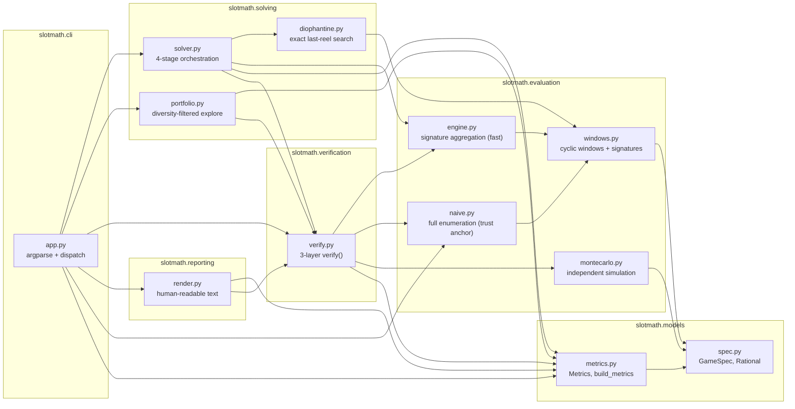
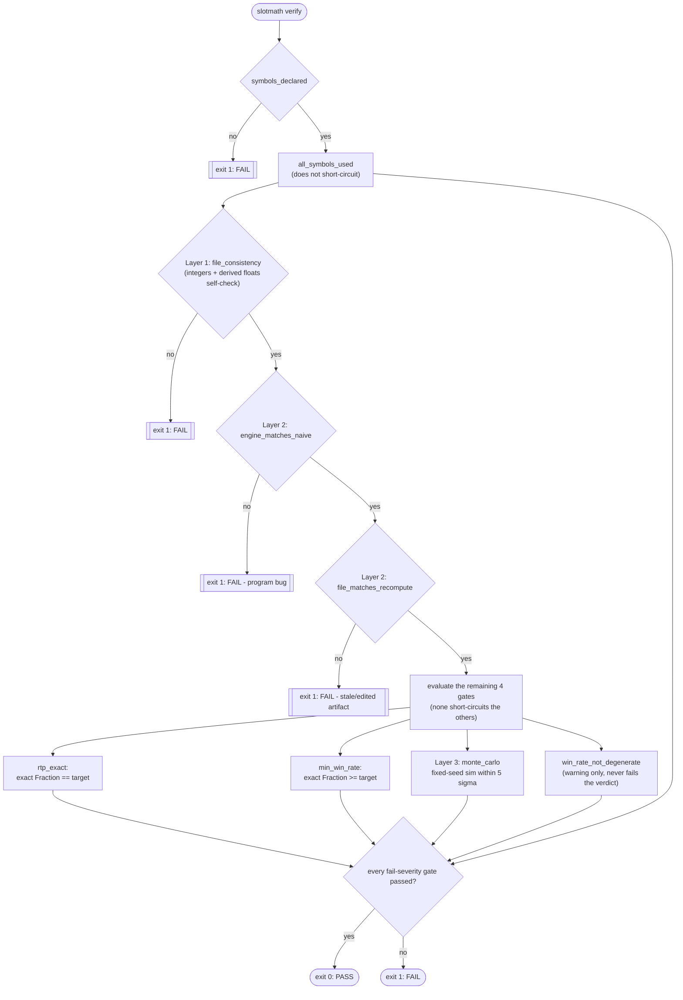

# slotmath

A toolkit for finding slot-machine reel configurations whose Return To Player (RTP) equals a target **exactly** — not approximately, not within a tolerance band, but as an exact rational number — while also meeting a minimum win-rate requirement. It exists because RTP claims in this domain need to be provable, not eyeballed from a simulation.

## Exact rational RTP

Every payout is tracked as an exact integer count of "payout units" (`Fraction`-typed internally; the unit is `1 / payout_unit_denominator`, the smallest common denominator across the whole paytable). RTP and win-rate are compared as exact `Fraction` equality/inequality against the target — never as floating point with an epsilon or tolerance band.

Floats (`rtp`, `win_rate`, `volatility`, `max_win` in a solved artifact) only ever appear as a **display convenience** layered on top of the integer counts. Nothing in the system makes a pass/fail decision from them — every gate that matters is computed from integer counts and compared with exact `Fraction` arithmetic. Monte Carlo simulation (below) is a **probabilistic sanity check** on top of that exact result, not a substitute for it: it can catch a shared translation bug, but it can never itself prove RTP equals a target exactly.

## Architecture

The package is organized by responsibility, not by which file happens to import which:

- **`slotmath.models`** — the two artifact schemas. `spec.py` defines `GameSpec` (grid, symbols, patterns, targets) as the single trust boundary for all external input, including the `Rational` type that coerces probabilities/multipliers to exact `Fraction`. `metrics.py` derives reportable `Metrics` (RTP, win rate, volatility, payout distribution) from an integer payout distribution.
- **`slotmath.evaluation`** — three independent evaluators that compute a payout distribution from a `GameSpec` and a set of reels, plus the shared cyclic-window/signature geometry (`windows.py`) that `naive.py`, `engine.py`, and `diophantine.py` (in `solving`) build on. `montecarlo.py` deliberately does **not** build on that geometry — see "Verification model" below.
- **`slotmath.solving`** — turns a `GameSpec` into reels that hit its targets. `diophantine.py` solves the last reel exactly as a linear system; `solver.py` orchestrates a multi-stage search (congruence-aware reel-length selection, run-composition seeding, the exact Diophantine search, and a local-search fallback); `portfolio.py` keeps a diversity-filtered collection of solutions across repeated `explore` runs.
- **`slotmath.verification`** — `verify.py`'s three-layer gate sequence (below), the only place a `ReelConfig` artifact is judged pass/fail.
- **`slotmath.reporting`** — pure text builders (`render.py`) that turn a `GameSpec`, a `ReelConfig` + `Metrics`, or a portfolio calibration dict into the exact strings the CLI prints. Kept separate from argument parsing so "what to compute" and "how to show it" change independently.
- **`slotmath.cli`** — `app.py` wires everything into the `slotmath` command: argument parsing, dispatch, and the exit-code contract.



Note that `montecarlo.py` has no arrow into `engine.py`, `naive.py`, or `windows.py` — that absence is the point (see below), and it's enforced by an AST-based test (`tests/test_montecarlo.py`), not just left to convention.

## Verification model

**Three independent evaluators** compute the payout distribution for a set of reels and are required to agree exactly:

- `naive.py` — full board enumeration, deliberately slow and simple. The trust anchor: correct by inspection, not by performance.
- `engine.py` — a fast signature-aggregating evaluator used by the solver's inner loop. Collapses each reel into a histogram over distinct per-column signatures (what a touching pattern would see: a matching symbol or `None`), turning `O(prod(len(reel_i)))` into `O(prod(|signatures_c|))` while remaining exact.
- `montecarlo.py` — an independent simulation path that shares no code with the other two (no import of `engine`, `naive`, or `windows`), so a shared translation bug (e.g. a transposed grid axis) in `naive`/`engine` doesn't silently agree with itself. Because Monte Carlo is inherently probabilistic, this layer is a fixed-seed **sanity check bounded to 5 standard errors** from the exact result — not a proof of exact equality, which only the integer-count comparison provides.

The combine-logic (how multiple winning patterns on one spin add up) is intentionally duplicated across all three modules rather than factored into a shared helper — a bug in one becomes a visible disagreement instead of a silent shared mistake.

`slotmath verify` runs these gates in order, all required to pass except the last (a warning):



`all_symbols_used` fails when a symbol declared in the spec never appears on any reel — dead weight in the paytable that RTP/win-rate targets alone would never catch, since neither depends on a symbol actually being reachable. It does not short-circuit like `symbols_declared` does: an undeclared symbol makes payout computation itself suspect, but a missing declared symbol doesn't stop Layers 1-3 from computing correctly, so they still run and report their own status independently.

`file_consistency` (Layer 1) also checks the four *display* floats (`rtp`, `win_rate`, `volatility`, `max_win`) against values derived from the integer counts, with a tolerance (`_FLOAT_RTOL = 1e-9`) that exists **only** to absorb float round-trip noise in that display check — it never touches the exact `Fraction` comparisons in `rtp_exact`/`min_win_rate`.

A **PostToolUse hook** (`scripts/hooks/verify_on_write.py`) runs this same verification automatically whenever a file under `configs/` or `solutions/` is written, so a bad artifact is reported back immediately instead of discovered later.

## Repository layout

```text
slot-reel-rtp/
├── configs/
│   └── homework-3x3.json          # GameSpec: 3x3 grid, 5 patterns, RTP 0.95 target
├── solutions/
│   ├── homework-3x3.json          # accepted ReelConfig deliverable
│   └── portfolio.json             # diversity-filtered explore() output
├── scripts/hooks/
│   └── verify_on_write.py         # PostToolUse hook: verify on every write
├── src/slotmath/
│   ├── models/                    # spec.py, metrics.py
│   ├── evaluation/                # windows.py, naive.py, engine.py, montecarlo.py
│   ├── solving/                   # diophantine.py, solver.py, portfolio.py
│   ├── verification/              # verify.py
│   ├── reporting/                 # render.py
│   └── cli/                       # app.py (+ __init__.py exposing main)
├── tests/                         # one test module per src/slotmath/*/*.py, plus
│                                   # test_hook.py, test_skills.py, fixtures.py
├── .claude/
│   ├── settings.json               # registers the PostToolUse hook
│   └── skills/                     # slot-math-model, reel-strip-solver,
│                                   # slot-config-verifier, slot-solution-explorer
├── pyproject.toml
└── uv.lock
```

## Install

Requires Python 3.11+ and [uv](https://docs.astral.sh/uv/).

```bash
uv sync --dev
```

This creates `.venv/` and installs `slotmath` (editable) plus its dev dependencies (`pytest`) from `uv.lock`.

## Quick start

```bash
# 1. Validate a GameSpec and print a summary (grid, symbols, targets, ...)
uv run slotmath spec configs/homework-3x3.json

# 2. Search for reels meeting the spec's RTP and win-rate targets
uv run slotmath solve configs/homework-3x3.json --seed 500 --out solutions/homework-3x3.json

# 3. Verify a solution against its spec through all three layers
uv run slotmath verify solutions/homework-3x3.json

# 4. Print a human-readable payout table for a solution
uv run slotmath report solutions/homework-3x3.json
```

A fifth command, `slotmath explore`, runs `solve` repeatedly and keeps a diverse *portfolio* of solutions (rejecting near-duplicates by a calibrated distance threshold over win rate, volatility, max win, payout entropy, and spin count):

```bash
uv run slotmath explore configs/homework-3x3.json --seed 500 --rounds 6 \
  --portfolio solutions/portfolio.json
```

### Exit codes

Exit codes are a contract across every command, because the PostToolUse hook depends on the distinction:

| Code | Meaning |
|---|---|
| `0` | Passed (or succeeded) |
| `1` | Verification did not pass |
| `2` | The tool itself could not run (missing file, malformed JSON, a schema violation) — says nothing about whether a solution is correct |

## The accepted deliverable

`solutions/homework-3x3.json` holds a genuine solution to `configs/homework-3x3.json` (a 3x3 grid, target RTP 0.95, minimum win rate 0.55), verified against the JSON artifact and a fresh evaluator recomputation:

| | |
|---|---|
| Reels | `[2,2,2]`, `[3,3,3,2,2,2,1,1]`, `[3,3,3,3,4,3,3,3,3,0,0,0,4,4,3]` |
| RTP | exactly `19/20` (0.95) |
| Win rate | exactly `17/30` (≈0.5667), above the 0.55 minimum |
| Max win | 3x |
| Symbols used | all five (0-4) |
| Spin count | 360 (`3 x 8 x 15`) |
| Payout distribution | `{0: 156 combos, 1x: 135 combos, 3x: 69 combos}` |

This is entry 0 of `solutions/portfolio.json` (produced by `slotmath explore configs/homework-3x3.json --seed 500`) and is independently reproduced byte-for-byte by `slotmath solve configs/homework-3x3.json --seed 500` — the `solver.command` recorded in the artifact is that literal, runnable command.

An earlier version of this file held a *degenerate* configuration — two symbols, win rate exactly 1 — that met the RTP and win-rate targets only by making it impossible for the player to lose. It was legal under the letter of the spec but not a real answer, and was replaced with the configuration above.

## Tests and verification

```bash
uv run pytest -v
```

runs the full suite (193 tests as of this writing): one test module per `src/slotmath/*/*.py`, plus `tests/test_hook.py` (including a subprocess test that runs the literal command configured in `.claude/settings.json`, not just an in-process call) and `tests/test_skills.py`.

To independently verify the accepted deliverable yourself:

```bash
uv run slotmath verify solutions/homework-3x3.json
```

should print nine gates, all `PASS` (one — `win_rate_not_degenerate` — is a warning-severity gate that also happens to pass here, since this configuration's win rate is below 1), and exit 0. Widen the Monte Carlo layer for a more thorough independent check:

```bash
uv run slotmath verify solutions/homework-3x3.json --mc-spins 20000000
```
